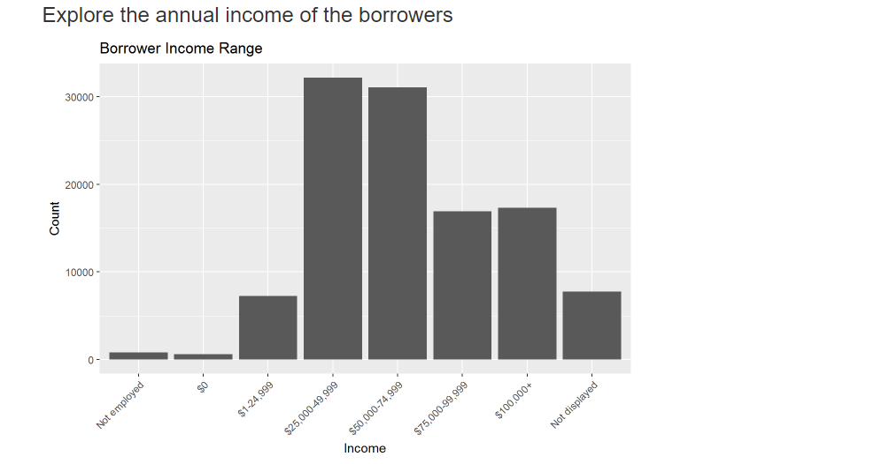
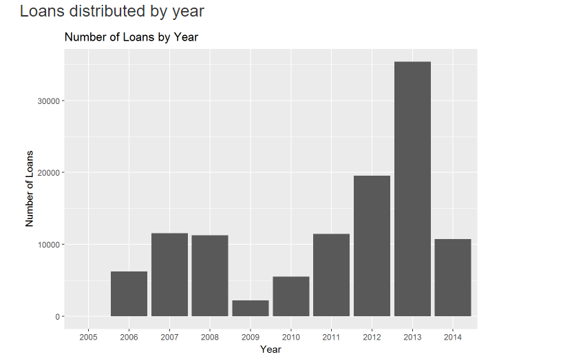
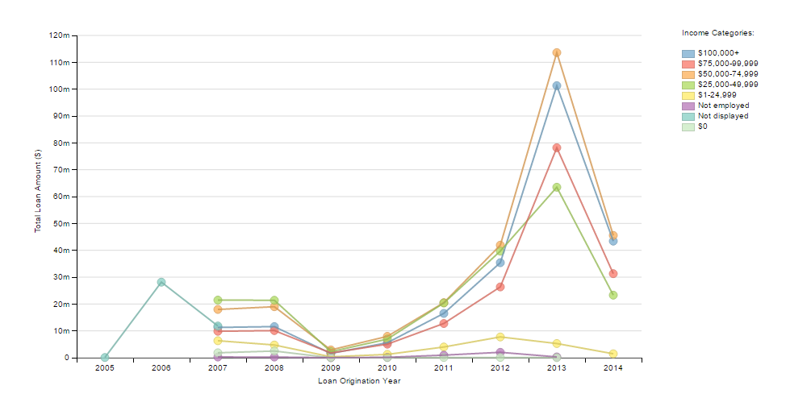

# Make Effective Data Visualization using d3.js and dimple.js
by Rehab Fathi Ali

## Summary

This visualization shows the effect of the financial crisis on the bank lending in the United States. It illustrates the total amount of loans for borrowers of different income ranges across the years 2005-2014. There was a huge drop in the loans in 2009, but the number of loans increased gradually after that. Strict measures were taken after the crisis and borrowers with no income or no job were not granted loans anymore.

## Design

### Initial

I conducted explarotory data analysis on this dataset in R for a Udacity Data Analyst Nanodegree project. I used the most 2 interesting plots as the initial sketches for my visualization and gathered feedback to make the dimple.js visualisation.

### Post-Feedback Design
- I used dimple.js for this visualisation
- Only features of interest were kept in the csv ( Loan amount, Loan origination year, Income range and Loan origination date)
- A line graph was used to capture the data from the two initial graphs to visualize the trend across the years while making a comparison between different income ranges
- The origination year was plotted on the x-axis which is used by convention
- Instead of plotting the number of loans, I replaced it with the loan amount because the dataset had many loans with very small amounts
- I deided to keep $0, unemployed and not displayed data after doing some search as they turned out to be not redundant
$0 : Borrowers with 0 income
Not employed: borrowers who have no jobs but may have other sources of income
Not displayed: We have no income data, the borrower may have left the field blank
- I added hover effect, when you hover over a point the loan amount, year and income range are displayed

## Feedback
### Feedback #1
> The two plots are interesting. I can see how the number of loans dropped in 2009 and how most citizens who apply for loand have income range $25,000-$75,000. It would be nice if these plots are integrated in one chart.

### Feedback #2
> My first impression was that the charts are boring with only one color and no legend. I hope the final visualisation is more interesting and eye capturing.

### Feedback #3
> The number range on the y axis is very broad. It would be better if I could know the exact number of loans. Also the harts are visually not appealing. They look like charts we could see in a scientific paper. Also, I can see that unemployed borrowers and $0 income ones have the same number of loans, are these redundant data?

## Resources

* [Bl.ocks](http://bl.ocks.org/)
* [Dimple home page](http://dimplejs.org/)
